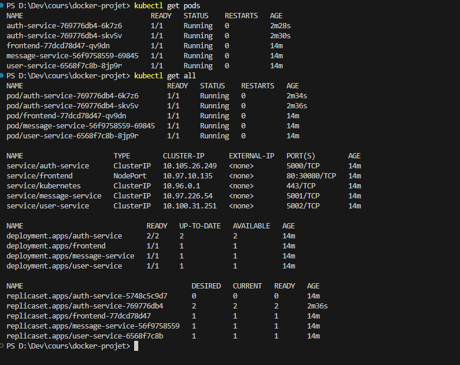
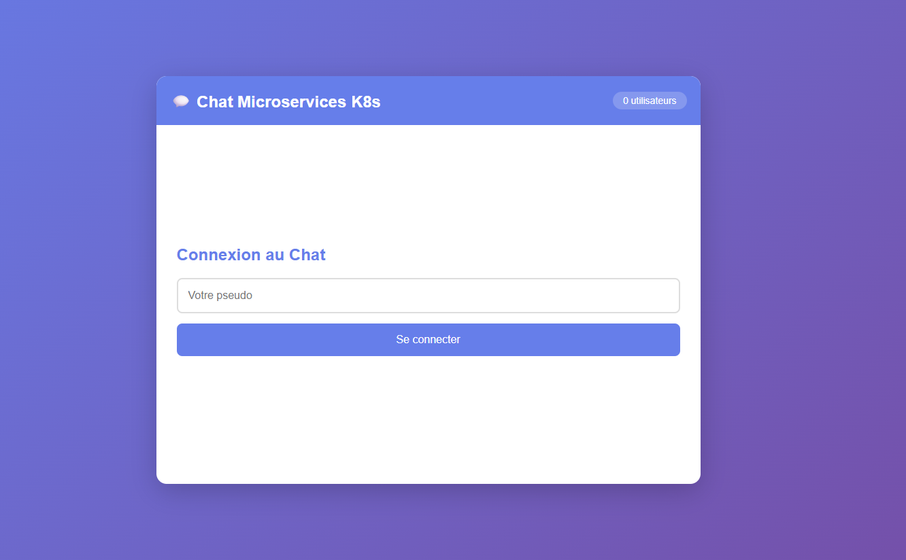
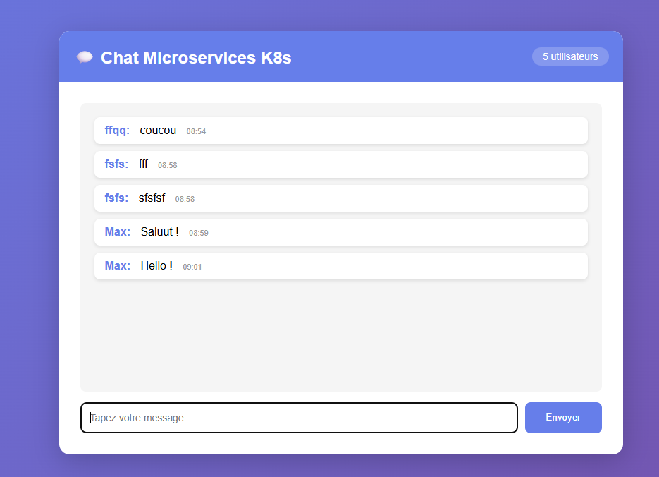
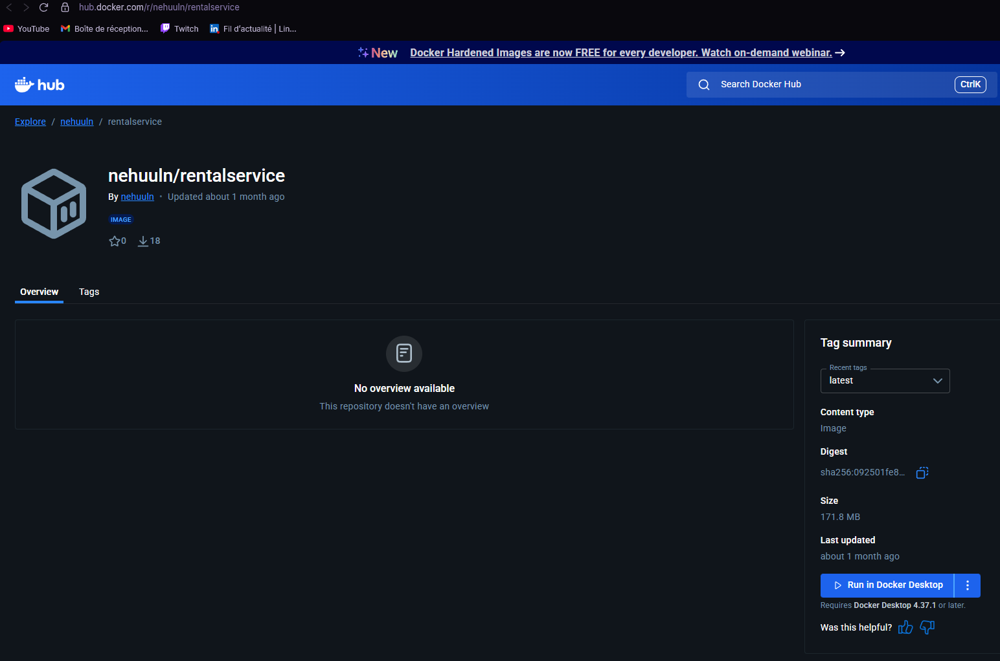
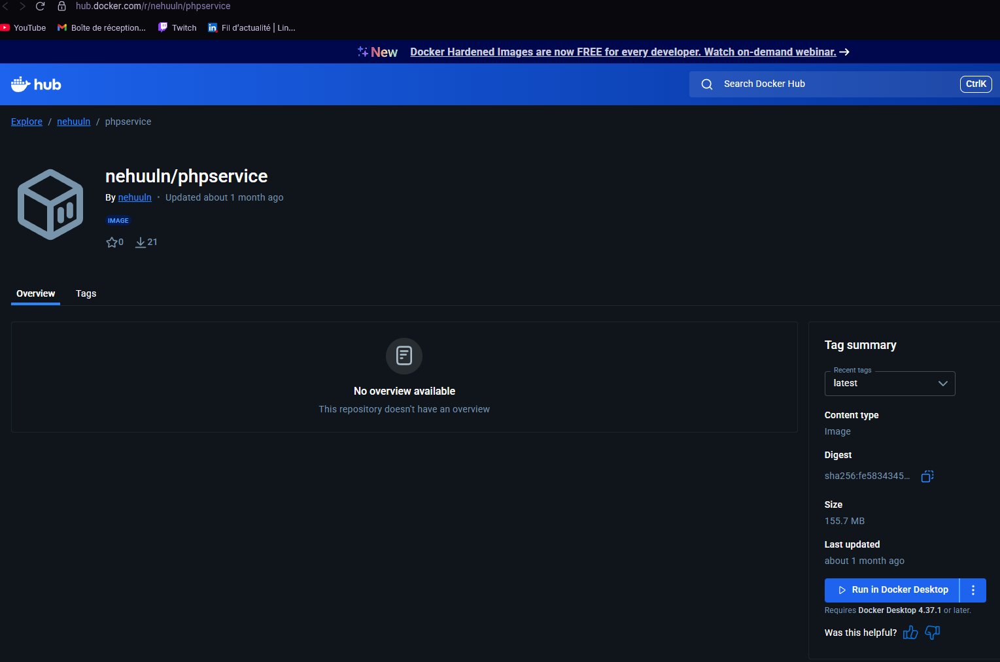

# 💬 Chat Microservices - Projet Kubernetes (Minikube)

Application de chat en temps réel utilisant une architecture microservices déployée sur Kubernetes avec **Minikube**.

## 📋 Description du Projet

Application de chat web composée de **3 microservices backend** et **1 frontend**, communiquant via HTTP et orchestrés par Kubernetes.

### Architecture des Microservices

```
┌─────────────┐
│   Frontend  │ (Nginx + HTML/JS)
│   :80       │
└──────┬──────┘
       │ HTTP
       ├──────────────┬──────────────┬──────────────┐
       │              │              │              │
┌──────▼──────┐ ┌────▼─────┐  ┌─────▼──────┐      │
│Auth Service │ │ Message  │  │   User     │      │
│   :5000     │ │ Service  │  │  Service   │      │
│             │ │  :5001   │  │   :5002    │      │
└─────────────┘ └────┬─────┘  └─────┬──────┘      │
                     │              │              │
                     └──────────────┴──────────────┘
                            HTTP calls
```

### Services

1. **auth-service** (Port 5000)
   - Génération de tokens JWT
   - Validation des tokens
   - Authentification des utilisateurs

2. **message-service** (Port 5001)
   - Stockage des messages en mémoire
   - Récupération de l'historique
   - Communication HTTP avec auth-service

3. **user-service** (Port 5002)
   - Gestion des utilisateurs connectés
   - Liste des utilisateurs en ligne
   - Communication HTTP avec auth-service

4. **frontend** (Port 80/30080)
   - Interface web utilisateur
   - Nginx comme reverse proxy
   - Polling HTTP vers les services backend

## 🛠️ Technologies Utilisées

- **Conteneurisation**: Docker
- **Orchestration**: Kubernetes (Minikube)
- **Backend**: Python 3.11 + Flask
- **Frontend**: HTML/CSS/JavaScript + Nginx
- **Communication**: HTTP REST

## 📁 Structure du Projet

```
docker-projet/
├── auth-service/
│   ├── app.py              # Service d'authentification
│   ├── requirements.txt
│   └── Dockerfile
├── message-service/
│   ├── app.py              # Service de messages
│   ├── requirements.txt
│   └── Dockerfile
├── user-service/
│   ├── app.py              # Service utilisateurs
│   ├── requirements.txt
│   └── Dockerfile
├── frontend/
│   ├── index.html          # Interface web
│   ├── nginx.conf          # Configuration Nginx
│   └── Dockerfile
├── k8s/
│   ├── configmap.yaml      # Configuration K8s
│   ├── auth-service.yaml   # Deployment + Service
│   ├── message-service.yaml
│   ├── user-service.yaml
│   ├── frontend.yaml
│   └── ingress.yaml        # Ingress (optionnel)
├── start-minikube.bat      # Déploiement complet (RECOMMANDÉ)
├── build-images.bat        # Script build Minikube
├── deploy-k8s.bat          # Script déploiement Minikube
├── cleanup-k8s.bat         # Script nettoyage
└── README.md
```

## 🚀 Installation et Déploiement avec Minikube

### Prérequis

- **Minikube** installé ([Installation](https://minikube.sigs.k8s.io/docs/start/))
- **kubectl** installé
- **Docker Desktop** (ou VirtualBox)
- Terminal PowerShell/CMD

### Installation de Minikube (si pas encore fait)

```powershell
# Avec Chocolatey
choco install minikube

# Ou télécharger depuis: https://minikube.sigs.k8s.io/docs/start/
```

### Méthode Rapide (Recommandée)

**Une seule commande pour tout faire :**

```powershell
.\start-minikube.bat
```

Ce script fait tout automatiquement :
- Démarre Minikube si nécessaire
- Configure Docker pour utiliser Minikube
- Construit toutes les images
- Déploie sur Kubernetes
- Affiche l'URL d'accès

## Captures d'écran

### 1. Démarrage de Minikube
```powershell
minikube start --driver=docker
minikube status
```

### 2. Lancer tout d'un coup
```powershell
.\start-minikube.bat
```

### 3. Vérification des Pods
```powershell
kubectl get pods
kubectl get all
```


### 4. Services Kubernetes
```powershell
kubectl get services
```


### 5. Interface de connexion


### 6. Interface de chat avec messages



## Fonctionnalités

### Kubernetes

**Deployments**
- 2 replicas pour chaque service backend
- 1 replica pour le frontend
- Gestion automatique des pods

**Services**
- ClusterIP pour les services backend (communication interne)
- NodePort pour le frontend (accès externe sur port 30080)

**ConfigMap**
- Centralisation de la configuration
- Variables d'environnement injectées dans les pods

**Resource Limits**
- Requêtes et limites de CPU/mémoire définies
- Optimisation des ressources

**Health Checks**
- Endpoints /health sur chaque service
- Monitoring de l'état des services

### Communication HTTP entre Microservices

**Auth-Service → Token Generation**
```
POST /login → génère un JWT
POST /verify → valide un JWT
```

**Message-Service → Auth-Service**
```
Appel HTTP pour vérifier le token avant de poster un message
```

**User-Service → Auth-Service**
```
Appel HTTP pour vérifier le token avant de marquer un user connecté
```

**Frontend → Tous les Services**
```
Nginx reverse proxy vers les 3 services backend
Polling HTTP toutes les 2 secondes
```

## Tests et Validation

### Test 1: Vérifier le cluster Minikube

```powershell
# Statut du cluster
minikube status

# Info du cluster
kubectl cluster-info

# Nodes
kubectl get nodes
```

### Test 1: Vérifier les pods et services

```powershell
# Tous les pods en Running
kubectl get pods

# Détails d'un pod
kubectl describe pod <nom-du-pod>

# Logs d'un service
kubectl logs -f deployment/auth-service
```

### Test 2: Tester la communication HTTP entre services

```powershell
# Accéder à un pod
kubectl exec -it <nom-pod-message-service> -- sh

# Depuis le pod, tester auth-service
curl http://auth-service:5000/health
# Devrait retourner: {"status":"healthy","service":"auth-service"}
```

### Test 3: Tester l'application

1. Ouvrir l'application via `minikube service frontend`
2. Se connecter avec un pseudo
3. Envoyer des messages
4. Ouvrir une 2ème fenêtre en navigation privée
5. Se connecter avec un autre pseudo
6. Vérifier que les messages apparaissent dans les deux fenêtres
7. Vérifier le compteur d'utilisateurs en ligne

## Nettoyage

### Supprimer les ressources Kubernetes

```powershell
.\cleanup-k8s.bat
```

### Arrêter Minikube

```powershell
# Arrêter (conserve les données)
minikube stop

# Supprimer complètement
minikube delete
```

## Commandes Utiles Minikube

```powershell
# Informations du cluster
minikube status
minikube ip
minikube service list

# Dashboard web (très utile pour les screenshots!)
minikube dashboard

# SSH dans le node Minikube
minikube ssh

# Voir les logs de Minikube
minikube logs

# Addons (ingress, metrics, etc.)
minikube addons list
minikube addons enable ingress
minikube addons enable metrics-server

# Ressources
kubectl top nodes
kubectl top pods

# Debugging
kubectl describe pod <pod-name>
kubectl logs -f <pod-name>
kubectl exec -it <pod-name> -- sh

# Redémarrer un deployment
kubectl rollout restart deployment/auth-service

# Historique de rollout
kubectl rollout history deployment/auth-service
```

### Problème 2: Pods en Pending

**Cause**: Ressources insuffisantes

**Solution**:
```powershell
# Redémarrer Minikube avec plus de ressources
minikube delete
minikube start --driver=docker --cpus=4 --memory=4096
```

### Problème 3: Service non accessible

**Solution**:
```powershell
# Utiliser la commande minikube service
minikube service frontend

# Ou vérifier l'IP et le NodePort
minikube ip
kubectl get service frontend
```

### Screenshots TP

## TP 1 




## TP2

Voir repository github : https://github.com/Nehuuln/ingnum




## TP3

Voir repository github : https://github.com/Nehuuln/tp-kubernetes  
Dossier ./screenshot/